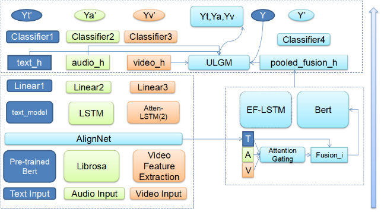

## MAG_Bert_ULGM
> Pytorch implementation for codes in A Multimodal Irony Recognition Framework With Self-Supervise Multi-task Learning.

本项目参考了下面的论文和代码

[Learning Modality-Specific Representations with Self-Supervised Multi-Task Learning for Multimodal Sentiment Analysis (AAAI2021)](https://arxiv.org/abs/2102.04830). Please see their another repo [MMSA](https://github.com/thuiar/MMSA) for more details, which is a scalable framework for MSA.

### Model

### Usage

 ./0428.sh

### 6.生成各种可视化需要的npz文件.py  
 1. tsne
 2. confusion_matrix

### 模型说明：
ours_v1 : Self_MM
ours_v2 : mag_bert

其他几种模型的源代码参考项目mmsa
